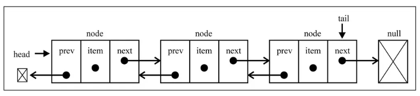

# 数据结构
常见的数据结构有
* 队列 Qyeue
* 树 Tree
* 堆 Heap
* 数组 Array
* 栈 Stack
* 链表 LinkedList
* 图 Graph
* 哈希表 Hash
### 队列
  Queue 是一种受限制线性表 先进先出(FIFO) 类似于排队买票。只允许在队列头部进行删除操作，在尾部进行插入操作。
### 链表
  链表中的元素在内存中不必是连续的，
  每一个元素本身有指针指向下一个元素和和指向上一个元素的指针。
  创建时不必确定大小长度， 可无限添加。
  插入，删除 时间复杂度O（1）
  无论访问任何位置的元素都需要从头开始查找，无法通过下标查找。
  #### 单向链表
  #### 双向链表
  
  
### 栈
  stack 是一种受限制线性表，后进先出(LIFO), 类似往木桶里装砖块。

### 集合
  无序的，不能重复，可以看做一种特殊的数组，里面的元素没有顺序，也不能重复。 
  > 可以直接使用ES6的Set类

### 字典
  一一对应，js中的对象就是字典
### 哈希表
  哈希表比数组快，没有顺序，不允许重复，空间利用率不高。
  > 数组结构 数组基于索引查找很快，基于内容查找不高，删除效率不高
### 树
#### 二叉搜索树 
非空左子数的所有键值小于其根节点的键值
              非空右子树的所有键值大于其根节点的键值
              左右字数本身都是二叉搜索树
              可能不平衡 非平衡树 
#### 红黑树
节点是红色或者黑色，根节点都是黑色，叶子节点都是黑色空节点
          每个红节点都有两个黑节点
          从任何节点到他的某个叶子节点 所走的路径上遇到的黑节点 都相同
### 图
类似树，只是每个节点直接都可以访问。每个节点交**顶点**，节点与节点的连线叫做**边**
#### 邻接矩阵表示图

如果 A - B 交叉的节点数字是 1 ，表示A B之间有边，若果A - B 交叉的节点数字是 0 ，表示A B之前无边
> 邻接矩阵，只能表示无向图，而且A A的交叉点会浪费空间。
#### 邻接表

A 对应的是一个数组，里面放着B，C，D。表示A->C, A->C, A->D.他们之前是右边，且有方向。
# 算法
### 大O表示法
| 符号          | 名称           |
| ------------- |:--------------:|
| O(1)          | 常数的         | 
| O(log(n))     | 对数的         |
| O(n)          |   线性的       |
| O(nlog(n))    |   线性和对数乘积|
| O(n*n)        |   平方         |

规则
 * 用常量1取代运行时间中所有的加法常量
 * 在修改后的运行次数函数中，只保留最高阶项
 * 如果最高存在而且不为1，则去除与这个项相乘的常数

 #### 排序算法
