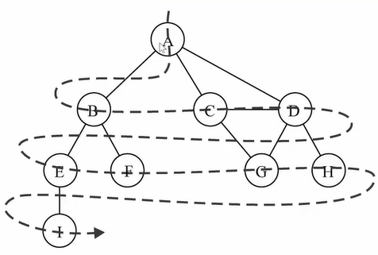

# 数据结构
常见的数据结构有
* 队列 Qyeue
* 树 Tree
* 堆 Heap
* 数组 Array
* 栈 Stack
* 链表 LinkedList
* 图 Graph
* 哈希表 Hash
### 队列
  Queue 是一种受限制线性表 先进先出(FIFO) 类似于排队买票。只允许在队列头部进行删除操作，在尾部进行插入操作。
### 链表
  链表中的元素在内存中不必是连续的，
  每一个元素本身有指针指向下一个元素和和指向上一个元素的指针。
  创建时不必确定大小长度， 可无限添加。
  插入，删除 时间复杂度O（1）
  无论访问任何位置的元素都需要从头开始查找，无法通过下标查找。
  #### 单向链表
  太简单，不写了
  #### 双向链表
  直接看图
  
  
### 栈
  stack 是一种受限制线性表，后进先出(LIFO), 类似往木桶里装砖块。

### 集合
  无序的，不能重复，可以看做一种特殊的数组，里面的元素没有顺序，也不能重复。 
  > 可以直接使用ES6的Set类

### 字典
  一一对应，js中的对象就是字典
### 哈希表
  哈希表比数组快，没有顺序，不允许重复，空间利用率不高。
  > 数组结构 数组基于索引查找很快，基于内容查找不高，删除效率不高
### 树
#### 二叉搜索树 
非空左子数的所有键值小于其根节点的键值
              非空右子树的所有键值大于其根节点的键值
              左右字数本身都是二叉搜索树
              可能不平衡 非平衡树 
#### 红黑树
节点是红色或者黑色，根节点都是黑色，叶子节点都是黑色空节点
          每个红节点都有两个黑节点
          从任何节点到他的某个叶子节点 所走的路径上遇到的黑节点 都相同
### 图
类似树，只是每个节点直接都可以访问。每个节点交**顶点**，节点与节点的连线叫做**边**
#### 图的遍历
* 广度优先搜索 BFS
从A开始向下一层一层遍历


* 深度优先搜索 DFS
从A开始向下一层B, B有两个边，然后再想B的第一个边E访问，等E这条线访问完，再访问B上的第二个边，然后B访问完了，再访问A的第二个边，依次这样下去


#### 邻接矩阵表示图


如果 A - B 交叉的节点数字是 1 ，表示A B之间有边，若果A - B 交叉的节点数字是 0 ，表示A B之前无边
> 邻接矩阵，只能表示无向图，而且A A的交叉点会浪费空间。
#### 邻接表

A 对应的是一个数组，里面放着B，C，D。表示A->C, A->C, A->D.他们之前是右边，且有方向。
# 算法
### 大O表示法
| 符号          | 名称           |
| ------------- |:--------------:|
| O(1)          | 常数的         | 
| O(log(n))     | 对数的         |
| O(n)          |   线性的       |
| O(nlog(n))    |   线性和对数乘积|
| O(n*n)        |   平方         |

规则
 * 用常量1取代运行时间中所有的加法常量
 * 在修改后的运行次数函数中，只保留最高阶项
 * 如果最高存在而且不为1，则去除与这个项相乘的常数

 ### 排序算法
 #### 冒泡排序
拿到下标0,跟相邻的下标1的元素比较，如果0的位置元素大，那就互换位置，然后下标1再和下标2的元素比较，如果1位置的元素大，那就互换，这样遍历一遍，最大的那个元素肯定放到最后了。然后再从0和1的位置开始比较，这次遍历到下标length-2的位置，因为最后的那个元素最大不用比较了，这次遍历完，length-3的位置就是第二大的元素。据这样依次找到个元素的位置.

```
 ArrayList.prototype.bubbleSort = function () {
  let length = this.arr.length
  // 反向遍历 设置内层循环的终点
  for (let k = length - 1; k >= 0; k--) {
    // 遍历 比较 i， i+1 位置的元素
    for (var i = 0; i < k; i++) {
      if (this.arr[i] > this.arr[i + 1]) {
        this.swap(i, i + 1) // 交换位置
      }
    }
  }
}
```
对于N个数据的数组，一共比较 (N - 1) + (N - 2) + (N - 3) + ... + 1 = N * (N - 1) / 2。
用大O表示法表示:
 1. 根据规则2 只保留最高阶项。N * (N - 1) / 2 = N²/2 - N/2 也就是  N²/2
 2. 跟胡规则3 如果最高阶项存在并且不是1，则去除与这个项相乘的乘数。 那就是N²/2 去除1/2。也就是N²
 3. 因为冒泡排序的大O是 O(N²)

 ### 选择排序
 拿出下标为0位置的数据，跟后边所有的数据依次比较，只要找到比他小的就互换，这样遍历下来，下标为0的，肯定是最小的。人后拿出下标为1的依次跟后面的比较，这样就找到第二小的数据。
 **选择排序的交换次数只有N-1次, 用大O表示法就是O(N)**

 ### 插入排序
 我们假如0的位置到数组头部的数都是有序的。拿出下标1位置的数，作为基数，去跟他之前的数比较，如果他之前的数比他大，就互换，一直比到头比他小的位置。然后再拿出2位置的数跟他之前的数比较。这样就做到了基数之前的数都是有序的。
 ### 希尔排序
希尔算法是在插入排序的基础上，做了一层分组。

先找一个增量（一般是长度的一半），从头开始以增量的长度分组。
>  比如 0， 0+增量，0+增量+增量 是一组。1， 1+增量，1+增量+增量是一组

然后每组再进行插入排序。

然后增量减小，再分组，再插入排序。

最后增量为1，就是正确的排序了。

### 快速排序


